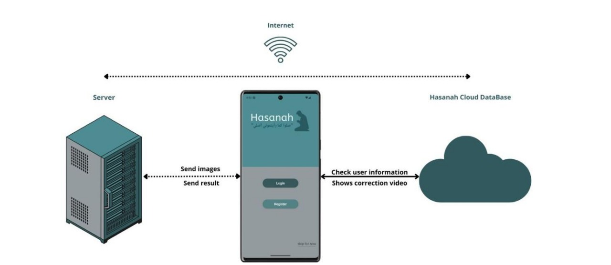
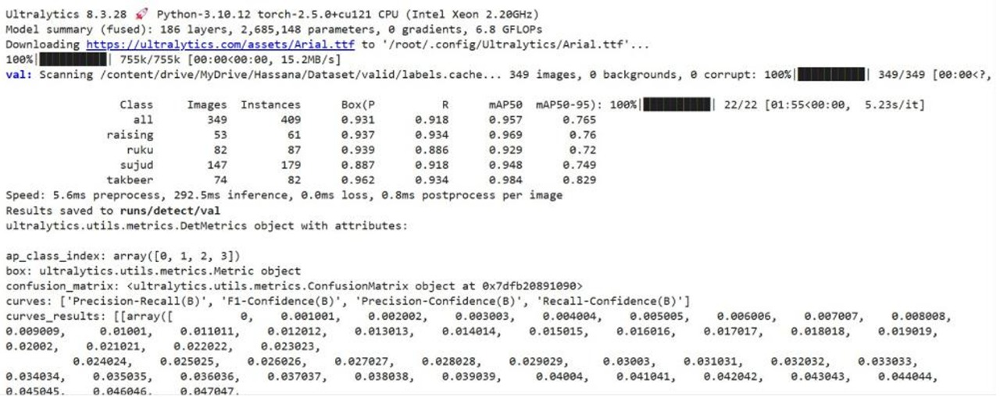

🕌 Hasanah — Prayer Posture Detection & Correction System

An AI-powered mobile system that analyzes Muslim prayer postures using Computer Vision, YOLOv8, CNNs, and pose estimation, detects mistakes, and provides personalized correction videos to guide users toward accurate prayer movements.

🌟 Key Features

1. YOLOv8-based posture detection

2. Correction videos tailored to each error

3. User history tracking

4. Secure login system

5. Clean, modern mobile UI

6. Privacy-focused processing

🧠 Technical Highlights

YOLOv8 for real-time object detection

CNNs for deep feature extraction

Pose Estimation for joint landmark analysis

Custom Dataset: 3,225 labeled prayer posture images

Performance:

✔ 93% Accuracy

✔ 91% Recall

✔ 95% mAP50

🏗 System Architecture

 
<strong>Click to Expand Architecture Diagram</strong>

📊 Results

 
<strong>Show Performance Metrics</strong>

| Metric   | Score   |
| -------- | ------- |
| Accuracy | **93%** |
| Recall   | **91%** |
| mAP50    | **95%** |
| mAP50–95 | **76%** |

Add your validation images:

🛠️ Tech Stack
🔹 Core AI & ML

  

🔹 Backend & Tools

  

🔹 Additional

    

▶ How to Run

Steps:

1. Upload a prayer posture image

2. System detects correct/incorrect posture

3. Highlighted errors appear

4. Correction video is displayed

5. History logs are stored for later review

📄 Full Documentation

Upload your full report and link it here:

📄 Hasanah.pdf
